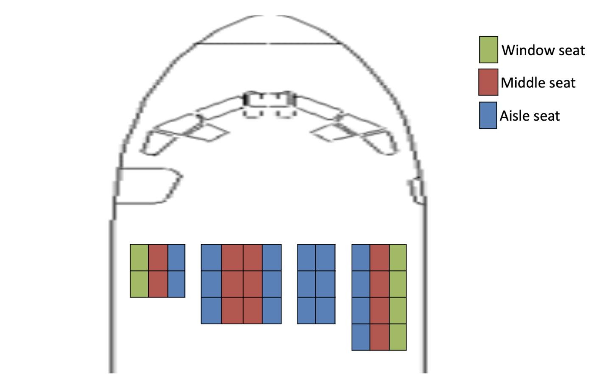
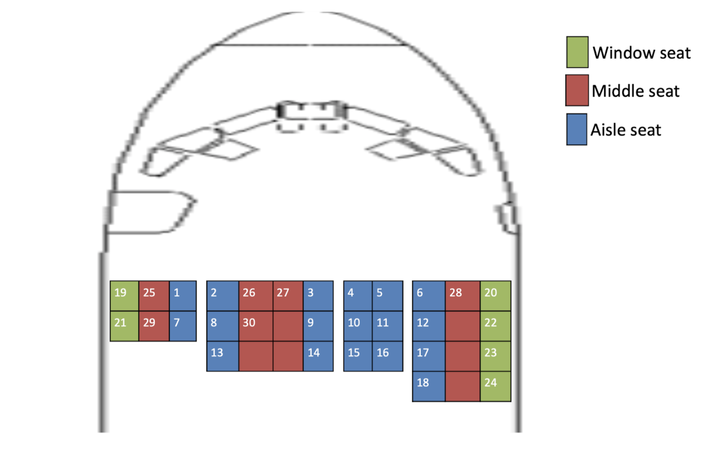

# README

**Airplane Seating Algorithm**

Write a program that helps seat audiences in a flight based on the following input and rules.

**Rules for seating**

1. Always seat passengers starting from the front row to back, starting from the left to the right
2. Fill aisle seats first followed by window seats followed by center seats (any order in center seats)

**Input to the program will be**

1. A 2D array that represents the columns and rows - Ex. [[3,4], [4,5], [2,3], [3,4]]
2. Number of passengers waiting in the queue.

**Example**

Given - A 2D array that represents the columns and rows - [[3,2], [4,3], [2,3], [3,4]]

If there were 30 passengers from then the seating output will be:

**Expectations:**

1. Code in Ruby/Ruby on Rails,python
2. Test cases
3. Clean and understandable code
